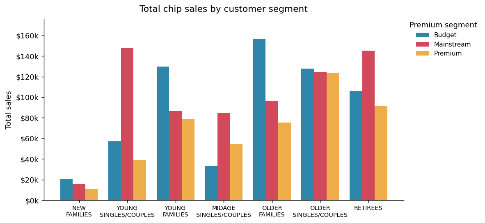
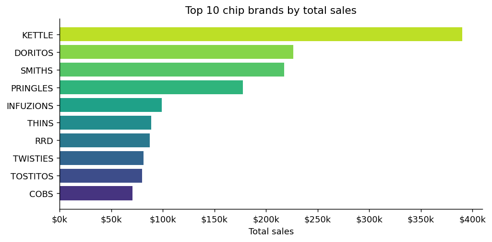
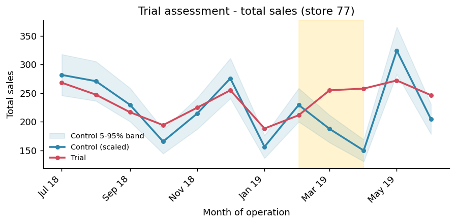

# Quantium – Retail Strategy & Analytics Job Simulation (Forage)

**Author:** Fariba Kazi · **Tools:** Python (pandas, NumPy, SciPy, matplotlib)

Completed all three tasks of Quantium's Retail Strategy & Analytics virtual job
simulation on Forage, acting as a data analyst for a supermarket's chip Category
Manager (Julia). The work spans data cleaning, customer analytics, a controlled
store experiment, and a client-ready recommendation deck.

---

## Task 1 — Data Preparation & Customer Analytics
**Problem:** Identify which customers drive chip sales and what drives their spend.

**Approach:** Cleaned 264,836 transactions (converted Excel serial dates, removed
18,094 non-chip salsa rows, removed a commercial-buyer outlier → 246,740 clean
rows), engineered pack-size and brand features, and merged in customer segments
(LIFESTAGE × PREMIUM_CUSTOMER) with no unmatched rows.

**Findings:**
- Top segments: Budget – Older Families ($157k), Mainstream – Young Singles/Couples
  ($148k), Mainstream – Retirees ($145k)
- Families buy the most chips per customer; Mainstream Young & Midage Singles/Couples
  pay the highest price per packet ($4.07 vs $3.69, t = 37.6, p < 0.001)
- Kettle is the #1 brand; 175g sharing packs are the most-bought format

---

## Task 2 — Experimentation & Uplift Testing
**Problem:** Did a Feb–Apr 2019 store-layout trial (stores 77, 86, 88) actually lift
sales, or was it just seasonality?

**Approach:** Built a control-store experimental design — matched each trial store to
a control using pre-trial Pearson correlation + magnitude distance on monthly sales
and customer counts, scaled the control, and tested each trial month against the
control's 5–95% confidence band (t-test, 7 d.o.f.).

**Findings:**
- Trial 77 → control 233: significant sales uplift (Mar & Apr)
- Trial 88 → control 237: significant sales uplift (2 of 3 months)
- Trial 86 → control 155: customers up significantly, but sales inconclusive —
  flagged for follow-up (possible different implementation/pricing)

---

## Task 3 — Analytics & Commercial Application
**Problem:** Turn the analysis into a recommendation Julia can use for the category
review.

**Approach:** Built a client-facing deck using the Pyramid Principle — lead with the
recommendation, support with segment, brand/pack, and trial evidence.

**Recommendation:** Protect high-volume family shoppers on price and pack
availability, target premium-willing Mainstream singles/couples with higher-margin
ranges, anchor space around Kettle + 175g packs, and roll out the new layout
(confirming why store 86 differed first).

📄 `QVI_Task3_ClientReport.pdf` · 📊 `QVI_Task3_ClientReport.pptx`

---

## Client Communication
**Email to Category Manager (Julia)** — a professional summary email accompanying
`QVI_Task3_ClientReport.pdf`. It leads with the key recommendation, highlights the
three main customer segments and the statistically significant trial uplift, and
offers to discuss the findings ahead of the category review — demonstrating the
ability to translate technical analysis into concise, actionable stakeholder
communication.

---

## Skills
Data cleaning · Feature engineering · Customer segmentation · Hypothesis testing ·
Control-store experimental design · Data visualisation · Stakeholder communication
